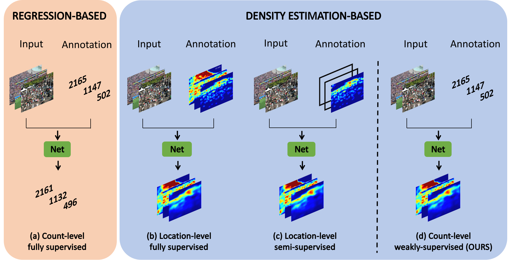
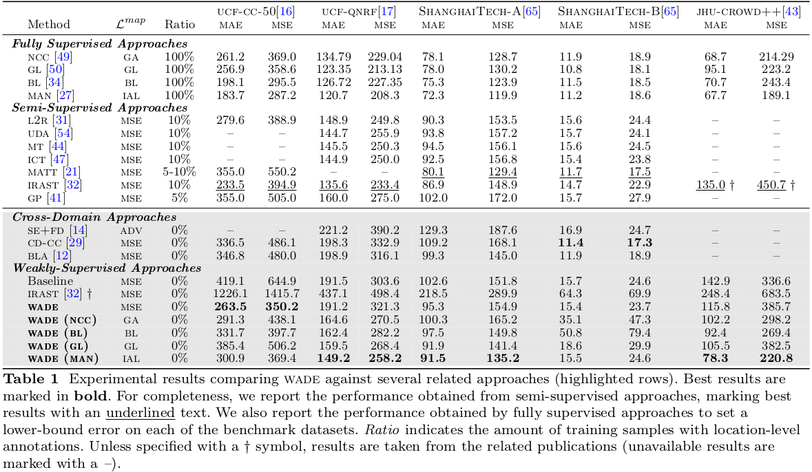
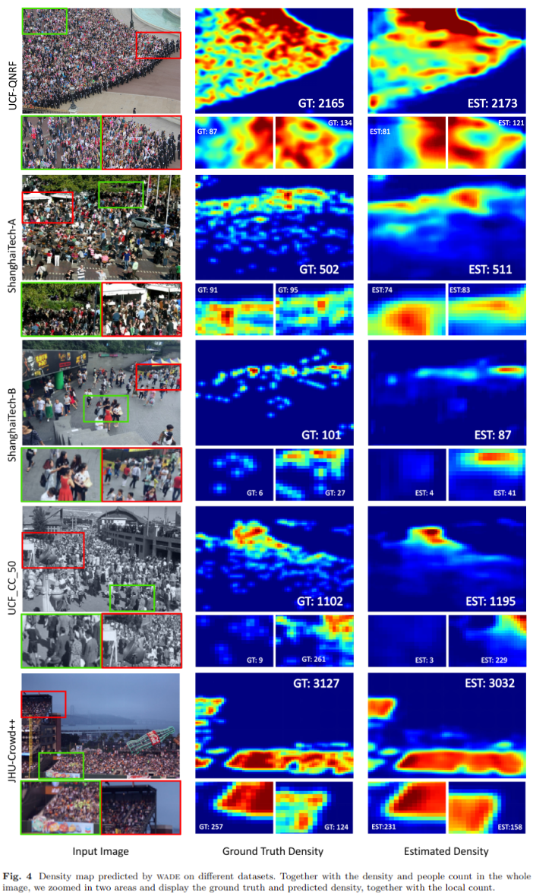

# Count-Level-Weakly-Supervised-Density-Estimation-for-Crowd-Counting

Official project page for the paper "**Count-Level Weakly-Supervised Density Estimation for Crowd Counting**" - _Mattia Litrico, Feng Chen, Michael Pound, Sotirios A. Tsaftaris, Sebastiano Battiato, Mario Valerio Giuffrida_.

## Abstract

Crowd counting is a well-known computer vision task aimed at determining the number and the density of individuals in an image. The main challenge in crowd counting is the need for location-level annotations, namely dots placed on top of each individual, as a form of supervision to train machine learning models. However, the collection of such annotations is tedious and time-consuming. To reduce the burden of collecting location-level annotations to predict crowd densities, this paper presents the _Count-Level Weakly-Supervised Density Estimation_: a setup that aims at predicting density maps when count-level annotations (e.g., total number of people) are the only form of supervision provided during training. We also propose WADE: the _Weakly Annotated Density Estimator_, a training framework agnostic to the deep neural network backbone, capable of predicting density maps leveraging _only_ count-level annotations. WADE is trained over pseudo-density maps that are generated using count-level annotations to recover the spatial information. Our approach outperforms baseline and competing methods and also yields comparable performance w.r.t.\ state-of-the-art semi-supervised methods which, unlike ours, require location-level annotations for 5-10\% of the training samples.

## Code

The official code will be released after the paper acceptance.

## Results

### Quantitative results

This table shows the quantitative results obtained by WADE on different datasets.

### Qualitative results

This figure shows the qualitative results obtained by WADE on different datasets.

### License

GNU GENERAL PUBLIC LICENSE 
Version 3, 29 June 2007
Copyright © 2007 Free Software Foundation, Inc. <http://fsf.org/>
